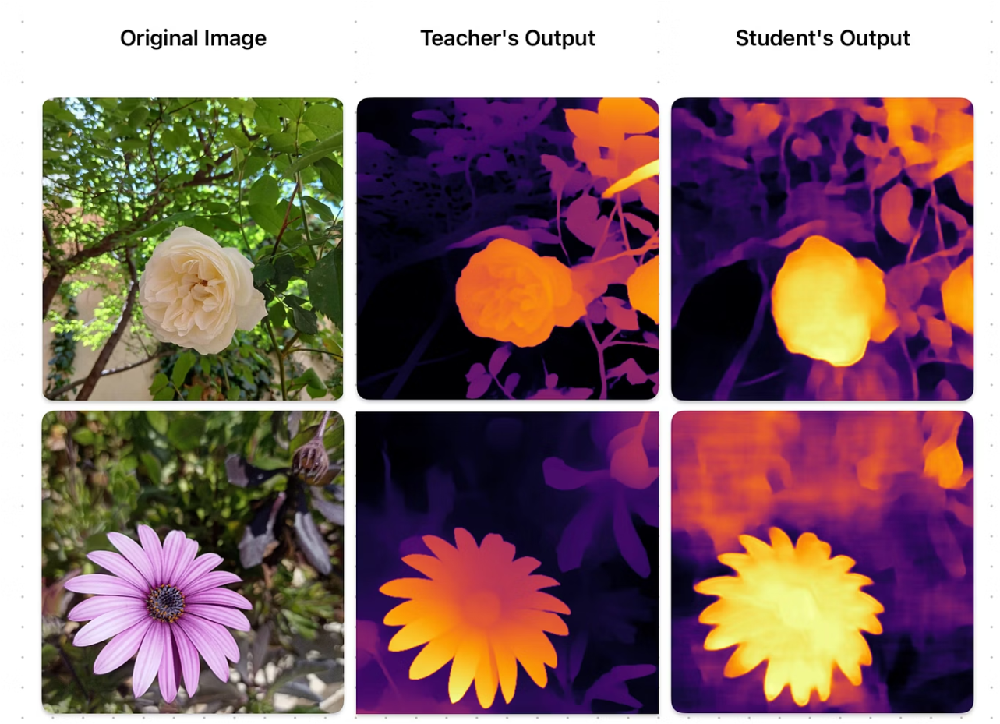

# Delta: A Lightweight, High-Quality Monocular Depth Estimation Project

**Delta** is a complete, end-to-end computer vision project for monocular depth estimation. It demonstrates how to leverage **knowledge distillation** to train a lightweight, efficient "student" model from a large, state-of-the-art "teacher" model. The final distilled model is deployed in a cross-platform **Flutter application** that can run inference on-device.

The core of this project is a **MobileVit-based student model** that learns to predict depth from a single RGB image by imitating the behavior of the powerful **DPT (Dense Prediction Transformer)** model. This approach creates a final model that is both accurate and fast enough for mobile applications.

For a more in-depth explanation of the model and the Flutter application, please refer to the documentation in the `docs` directory:

  * [**Model Documentation**](docs/model_docs.md)
  * [**Flutter App Documentation**](docs/model_docs.md)

---

## Preview



---

## ✨ Key Features

  * **Teacher-Student Architecture**: Uses the `depth_anything_v2` model as a teacher to ensure high-quality depth predictions.
  * **Efficient Student Model**: Employs a custom DPT-style decoder on a **MobileViT** backbone, making it small and fast.
  * **Advanced Knowledge Distillation**: Implements a combined distillation loss function, using pixel-wise, gradient matching, scale-invariant, and feature-based losses to effectively transfer knowledge from the teacher's output and intermediate layers.
  * **End-to-End Pipeline**: Provides a full workflow from model training and evaluation to exporting for mobile deployment.
  * **Model Export**: Includes scripts to convert the trained PyTorch model to **ONNX** for mobile use.
  * **Cross-Platform Mobile App**: A Flutter app for Android and iOS that lets you pick an image from your gallery and visualize the generated depth map in real-time, or lets you view a live depth camera.

-----

## 📂 Project Structure

The repository is organized into two main parts: the `model` and the `app`.

```
delta/
├── app/         # Flutter mobile application
│   ├── lib/     # Core Dart application logic
│   ├── assets/  # Location for the .onnx model
│   └── ...
└── model/       # PyTorch model, training, and conversion scripts
    ├── config/  # configurations for the pipeline
    ├── criterions/ # Knowledge distillation loss functions
    ├── data/ # Custom data used for training and evaluating
    ├── datasets/ # Dataset loaders used for loading and preproccessing raw data
    ├── models/  # Teacher and student model definitions
    ├── notebooks/  # Jupyter notebooks for experimentation
    ├── scripts/    # Training, inference, and evaluation scripts
    ├── utils/      # Utility scripts, including pth -> onnx converter
    ├── requrements.txt    # requirments for the python environment
    └── ...
```

-----

## 🧠 Model & Training

The core of the project is the knowledge distillation process, which trains the student model.

### Teacher Model

The teacher is the **Depth-AnythingV2** model, a powerful Vision Transformer-based model fine-tuned for monocular depth estimation on the MiDaS dataset. It provides the high-quality depth predictions that the student model learns to replicate.

### Student Model

The student model is designed to be efficient. It uses a **MobileViTV2-XS** encoder, pre-trained on ImageNet, to extract features. These features are then passed to a custom, lightweight **DPT-style decoder** (`MiniDPT`) which upsamples them to produce the final depth map.

### Distillation

The training process minimizes a **`CombinedDistillationLoss`**, which is a weighted sum of four components:

1.  **Scale-Invariant Log (SILog) Loss**: Measures the overall accuracy of the predicted depth map.
2.  **Gradient Matching Loss (L1)**: Enforces that the student's depth map has similar edges and fine details as the teacher's.
3.  **Feature Matching Loss (L1)**: Encourages the student's intermediate feature representations to be similar to the teacher's.
4.  **Attention Matching Loss (L2)**: Encourages the student to focus on the same spatial regions of the image as the teacher.

-----

## 🚀 Getting Started

### 1\. Model Training & Conversion

To train the model yourself or run inference, navigate to the `model` directory.

**Prerequisites:**

  * Python 3.8+
  * PyTorch
  * CUDA-enabled GPU (recommended for training)

**Installation:**


```bash
# Navigate to the model directory
cd model
# build a new enviroment (recommended)
pyhton -m venv venv
# Install all required Python packages
pip install -r requirements.txt
```

**Training:**
The training process is handled by the `scripts/train.py` script. You will need to provide paths to your dataset and configure the training parameters in a config file (see `config/config.py`).
run the following:
``` bash
python -m scripts.train                                                                               
```

**Inference & Export:**

1.  **Run Inference**: Use `scripts/infer.py` to test the trained model on sample images.

``` bash
python -m scripts.infer --model-path checkpoints/Delta.pth --input-path data/TestImages
```
2.  **Export to ONNX**: Use the `scripts/pth2onnx.py` script to convert your trained PyTorch model (`.pth`) into the ONNX format.

``` bash
python -m scripts.pth2onnx checkpoints/Delta.pth  --output_dir export --verbose   
```


### 2. Running the Flutter App

**Prerequisites:**

  * [Flutter SDK](https://docs.flutter.dev/get-started/install) installed on your machine.
  * An Android or iOS device/emulator.

**Setup & Run:**

1.  **Place the Model**: Copy your generated `Delta.onnx` file and place it inside the `app/assets/` directory. (the model is already in the assets for now)
2.  **Get Dependencies**:
    ```bash
    # Navigate to the app directory
    cd app

    # Install Flutter dependencies
    flutter pub get
    ```
3.  **Run the App**:
    ```bash
    # Launch the application
    flutter run
    ```

The app will launch, allowing you to select an image and view the resulting depth map rendered with a viridis/grayscale colormap.

## Acknowledgements

This project utilizes the `Depth Anything V2` model as the teacher model for knowledge distillation. The success of our student model is heavily reliant on the incredible work done by the authors of Depth Anything. We sincerely thank them for making their research and models publicly available.

If you use or find this work inspiring, please consider citing the original papers:

**1. Depth Anything V1**
> Yang, L., Kang, B., Huang, Z., Xu, X., Feng, J., & Zhao, H. (2024). *Depth Anything: Unleashing the Power of Large-Scale Unlabeled Data*. Proceedings of the IEEE/CVF Conference on Computer Vision and Pattern Recognition (CVPR).

<details>

<summary>BibTeX</summary>

```bibtex
@inproceedings{depth_anything_v1, 
   title={Depth Anything: Unleashing the Power of Large-Scale Unlabeled Data},  
   author={Yang, Lihe and Kang, Bingyi and Huang, Zilong and Xu, Xiaogang and Feng, Jiashi and Zhao, Hengshuang}, 
   booktitle={CVPR}, 
   year={2024} 
}
```
</details>

**1. Depth Anything V2**
> Yang, L., Kang, B., Huang, Z., Zhao, Z., Xu, X., Feng, J., & Zhao, H. (2024). *Depth Anything V2*. arXiv:2406.09414.

<details>

<summary>BibTeX</summary>

```bibtex
@article{depth_anything_v2, 
   title={Depth Anything V2}, 
   author={Yang, Lihe and Kang, Bingyi and Huang, Zilong and Zhao, Zhen and Xu, Xiaogang and Feng, Jiashi and Zhao, Hengshuang}, 
   journal={arXiv:2406.09414}, 
   year={2024} 
}
```

</details>

## 🐛 Bug Reports & Feature Requests

Have a bug or a feature request? Please open a new issue via the [Issues tab](https://https://github.com/k3rnel-paN1c5/Delta/issues).